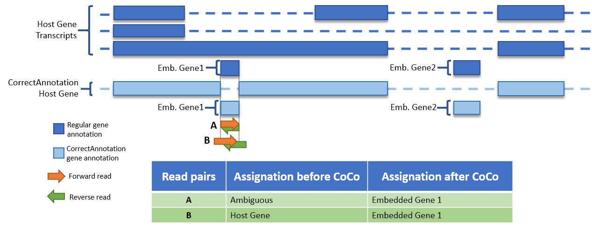
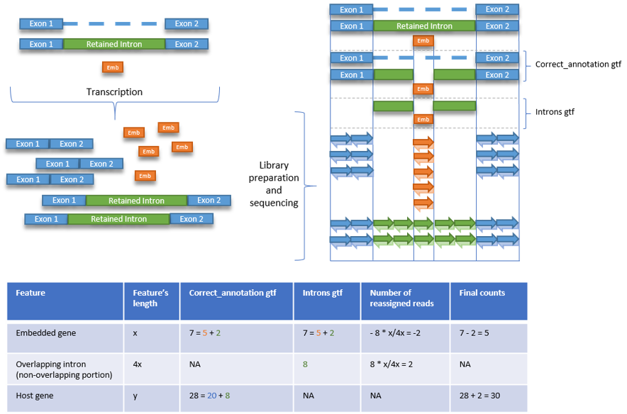
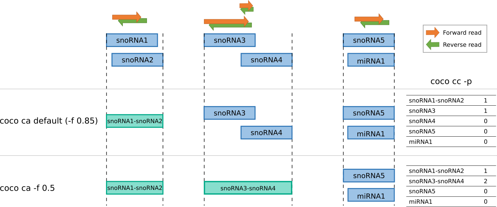
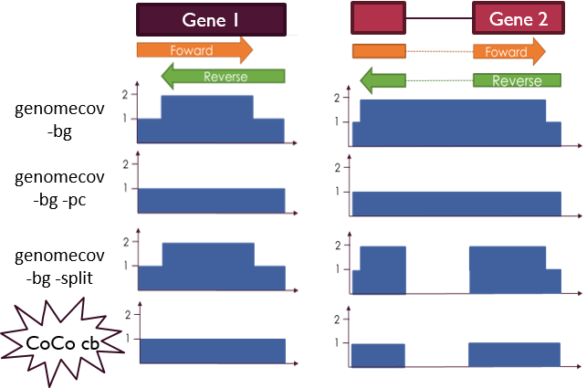

# CoCo Manual

Here we describe how users can make use of CoCo.
CoCo is divided into two main run modes: **correct_annotation** and **correct_count**, 
and one accessory mode: **correct_bedgraph**, each with their own parameters, and can be used as such:

```
coco [run mode] [args]
```

You can also run it directly from the bin:

```
cd path/to/coco/bin/
./coco [run mode] [args]
```

Here is how a user (you) can use the three CoCo modules to get to the desired output (whether it be the corrected gene 
expression values, the corrected paired-end bedgraph or both)


Here's a description of what each run modes do:

## correct_annotation
`correct_annotation` is used to produce a modified annotation file from an input gene transfer format (.gtf) annotation 
file obtained from **Ensembl**. The corrected annotation consists of a version of the original annotation where exon 
portions of host genes that overlap embedded genes are removed (see image below).

This change to the annotation, although minor, allows reads that overlap these regions span by both host gene and 
embedded genes to be assigned to the embedded gene (if the read pair has at least 51% overlap on the embedded gene). 
This is a game changer for many embedded genes which would otherwise have a total 0 read alignment count as all their 
reads would be considered as ambiguous.

Basic usage:
```
coco correct_annotation path/to/your/annotation/hg38_annotation.gtf
```



The embedded gene biotypes considered by default are: snoRNA, scaRNA, snRNA, miRNA and tRNA. Biotypes considered can be 
modified using the `-b/--biotypes` argument. Therefore, **the original annotation 
file should have a "gene_biotype" entry for each gene**. This might not be included into the annotation files from other 
sources than Ensembl and so **we recommend that you get the annotation from Ensembl** or add a "gene_biotype" attribute 
to all your gtf entries.

A second annotation file will be created, having the suffixe ".introns.gtf". This file will contain the part of the 
retained intron and exon surrounding the overlapping embedded genes. This file will be used by the `correct_count` module
to determine whether the reads come from the host or the embedded gene. (See figure below)



Finally, `correct_annotation` merges overlapping embedded genes having the same biotype (probable duplicates in the 
annotation). By default, `correct_annotation` will merge genes having >=85% overlap as shown below. The minimal overlap 
can be set to any values between ]0,1] by using the `-f/--fraction` option. 
This feature can be disabled with `-f/--fraction -1`.
 
   

## correct_count

`correct_count` is used to produce the corrected read counts per gene through the use of featureCounts as well as 
their count per million (CPM) and approximated transcripts per million (TPM) values. This module takes as input your 
alignment file in .bam format and the modified (.gtf) annotation file produced by `correct_annotation`.

Basic usage:
```
coco correct_count <args> path/correct_annotation.gtf path/Alignment.bam path/to/output
```

`correct_count`, by default, takes both uniquely mapped and multi-mapped reads to evaluate the read counts per gene. It 
splits the multi-mapped reads between the mapped genes according to their uniquely mapped read count.

The user can specify with the `--countType` parameter whether to use only uniquely mapped reads or both uniquely and 
multi-mapped reads (default to both) to evaluate the read count per gene.

Results will be output to the specified output file.

## correct_bedgraph

`correct_bedgraph` is used to produce bedgraph files from a **paired-end** dataset that give a more accurate depiction of the 
read abundance per genomic region than regular bedtools genomecov methods. It mainly does so by removing the 
overestimation of read alignment count for a given genomic position due to forward and reverse read overlapping. The 
previous methods (as shown in the figure below) introduce biases by either doubling the count for regions on which 
the forward and reverse read for a given pair overlap, or by counting the in-between region of a gapped alignment 
(such as an alignment on an exon junction).

`correct_bedgraph` brings about the best of both worlds as it won't double the score if the reads from a pair overlap 
with one another and won't count the gaps in alignments. By doing so, it gives a more representative visualisation of 
read abundance on the whole genome. See the figure below for a visual explanation.

Basic usage:
```
coco correct_bedgraph <args> path/to/your/bam/alignment.bam path/to/your/output.bedgraph
```


