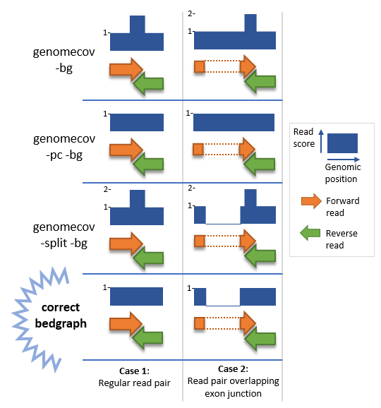

# CoCo Manual

Here we describe how users can make use of CoCo.
CoCo is divided into two main run modes: **CorrectAnnotation** and **CorrectCount**, and one accessory mode: **CorrectBedgraph**, each with their own parameters, and can be used as such:

```
coco [run mode] [args]
```

You can also run it directly from the bin:

```
cd path/to/coco/bin/
./coco [run mode] [args]
```

Here's a description of what each run modes can do:

## CorrectAnnotation
CorrectAnnotation should be used first in order to produce a modified annotation file from an input gene transfer format (.gtf) annotation file obtained from **Ensembl**.
Basic usage:
```
coco CorrectAnnotation path/to/your/annotation/hg38_annotation.gtf
```

The corrected annotation consists in a version of the original annotation where exon portions of host genes that overlap embedded genes are removed (see image below).


The considered embedded gene biotypes are: snoRNA, scaRNA, snRNA, miRNA and tRNA. Therefore, **the original annotation file should have a "gene_biotype" entry for each genes**. This might not be included into the annotation files from other sources than Ensembl and so **we recommend that you get the annotation from Ensembl**.

## CorrectCount

CorrectCount is used to produce the corrected read counts per gene as well as their count per million (CPM) and approximated transcripts per million (TPM) values. This step takes as input your alignment file in .bam format and the modified (.gtf) annotation file produced by CorrectAnnotation although it will work with an original annotation file as well; this allows the user to choose whether or not to do the correction for embedded genes.
Basic usage:
```
coco CorrectCount path/to/your/annotation/hg38_annotation.gtf
```

The user can also specify with the count_type parameter whether to use only uniquely mapped reads, only multi-mapped reads or both uniquely and multi mapped reads (default to both) to evaluate the read count per gene.

Results will be output to the specified output path.


## CorrectBedgraph

CorrectBedgraph is used to produce bedgraph files from a paired-end dataset that removes the over estimation of read alignment count for a given genomic position when its forward and reverse read tend to overlap alot. This is very often the case with small RNA such as snoRNA that the forward read totally reverse read from its pair. The genomecov --split method would then count the read pairs as two count rather than a single one because it considers reads from pairs seperately. Althought genomecov can be used in a non-split fashion, this brings about the problem that read pairs are considered as fragments, and so, if two paired reads are aligned on different exons, the whole region between the two reads (meaning the entire introns) has its score raised as well as the two regions span by the reads themselves.

CorrectBedgraph brings about the best of both worlds as it considers reads seperately but will not double the score if the reads from a pair overlap with one another. See the figure below for a visual explanation.



Basic usage:
```
coco CorrectBedgraph path/to/your/bam/alignment.bam path/to/your/output.bedgraph
```
