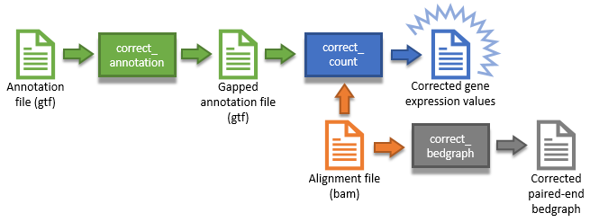

# **CoCo**: Count Corrector for embedded and multi-mapped genes.

CoCo is a pipeline designed to improve the evaluated abundances of embedded and multi-mapped genes from RNA-seq alignment data. CoCo is divided in two main parts which can be used together or seperately, depending on user's preferences. The first part being a correction of the gene annotation used by read assignment softwares such as featureCounts or HTSeq in order to correct the evaluated read counts for embedded genes such as snoRNA, that overlap features of their host gene's transcripts such as retained introns and exons. The second part of the correction distributes multi mapped reads in relation to the evaluated read counts obtained from single mapped reads.

We've shown that the combination of these two corrections gives the best correlation of the evaluated gene abundance from RNAseq data with abundances evaluated from other methods such as qPCR.


## **Getting Started**

These instructions will get you a copy of the project up and running on your local machine for development and testing purposes.


### **Prerequisites**

Here are the tools that must be installed for CoCo to work:
* [**Subread**](http://subread.sourceforge.net/), for the *featureCounts* function, which is used by CorrectCount to produce the read counts per genes. [Click here for installation guidelines](http://bioinf.wehi.edu.au/subread-package/)
* [**BEDtools**](http://bedtools.readthedocs.io/en/latest/), for the *intersect* function which is used by CorrectAnnotation and for *genomecov* which is used by CorrectBedgraph. [Click here for installation guidelines](http://bedtools.readthedocs.io/en/latest/content/installation.html)
* [**samtools**](http://samtools.sourceforge.net/), for the *view* function which is used to verify bam integrity and to get max read length. [Click here for installation guidelines](http://www.htslib.org/download/)

CoCo scripts are mostly python3, so be sure you have python3 installed and working. (tested for python 3.5)
CoCo also uses some python3 packages:
* [**pandas**](http://pandas.pydata.org/), [Click here for installation guidelines](http://pandas.pydata.org/pandas-docs/stable/install.html)


### **Installing**

Installing CoCo is done in a few easy steps.

First, you must clone the git repositroy to your favourite directory.

```
cd /path/to/clone/
git clone http://gitlabscottgroup.med.usherbrooke.ca/scott-group/coco.git
```

Next, you have to add the /bin/ path of the coco repository to your PATH environment variable.
this is easily done by opening your .bashrc file in your $HOME repository and add this line at the bottom:

```
export PATH=/path/to/clone/coco/bin:$PATH
```

And then you're pretty much done! You should have access to the **coco** command from your terminal.

 ```
coco --help
>>	CoCo: Count Corrector for embedded and multi-mapped genes.
	Version: 0.1.0
	Usage: CoCo <Run mode> <Run mode specific arguments>

	Run modes:
		CorrectAnnotation:	Produce modified annotation for embedded genes.
		CorrectCount:		Produce gene expression values, taking multi-mapped reads into account.
		CorrectBedgraph:	Produce paired-end bedgraphs.

	-h, --help	show this help message and exit

	For more info, please refer to the README file.
```


## **Usage**

Once the repository is downloaded and its /bin/ path is added to your PATH environment variable, CoCo can be called directly from your terminal.
CoCo is divided into two main run modes: **CorrectAnnotation** and **CorrectCount**, and one accessory mode: **CorrectBedgraph**, each with their own parameters, and can be used as such:

```
coco [run mode] [args]
```

You can also run it directly from the bin:

```
cd path/to/coco/bin/
./coco [run mode] [args]
```

Here is how a user (you) can use the three CoCo modules to get to the desired output (whether it be the corrected gene expression values, the corrected paired-end bedgraph or both)



For detailed information about the usage of every run modes, please refer to the [**MANUAL.md**](MANUAL.md).


## **Authors**

* **Gabrielle Deschamps-Francoeur** - *Making of the multi-mapped read correction.*
* **Vincent Boivin** - *Making of the annotation correction for ambiguous reads.* - [boiv2803](http://gitlabscottgroup.med.usherbrooke.ca/u/boiv2803)
* **Michelle Scott** - *Mastermind of the project and awesome PI* - [scottgroup](http://scottgroup.med.usherbrooke.ca/)

See also the list of [contributors](https://github.com/your/project/contributors) who participated in this project.


## **License**

This program is free software: you can redistribute it and/or modify
it under the terms of the GNU General Public License as published by
the Free Software Foundation, either version 3 of the License, or
(at your option) any later version.

This program is distributed in the hope that it will be useful,
but WITHOUT ANY WARRANTY; without even the implied warranty of
MERCHANTABILITY or FITNESS FOR A PARTICULAR PURPOSE.  See the
GNU General Public License for more details.

For more information about the GNU General Public License, see <http://www.gnu.org/licenses/>.


## **How to cite us**

Scientific results produced using CoCo shall acknowledge its use. Please cite as 

       ---


## **Acknowledgments**

* Hat tip to Fabien Dupuis-Sandoval for starting this project from scratch.
* Many thanks to Jean-Michel Garrant as well for his general wisdom.
* Thanks to Kamil Slowikowski [slowkow](https://gist.github.com/slowkow) for its GTF.py and gtf_to_csv.py scripts that are used by CorrectAnnotation.


## **References**
**CoCo**:

**featureCounts** Liao Y, Smyth GK, Shi W. featureCounts: an efficient general purpose program for assigning sequence reads to genomic features. Bioinformatics. 2014;30(7):923-30.

**bedTools**: Quinlan AR, Hall IM. BEDTools: a flexible suite of utilities for comparing genomic features. Bioinformatics. 2010;26(6):841-2.

**samtools** Li H, Handsaker B, Wysoker A, et al. The Sequence Alignment/Map format and SAMtools. Bioinformatics. 2009;25(16):2078-9.

